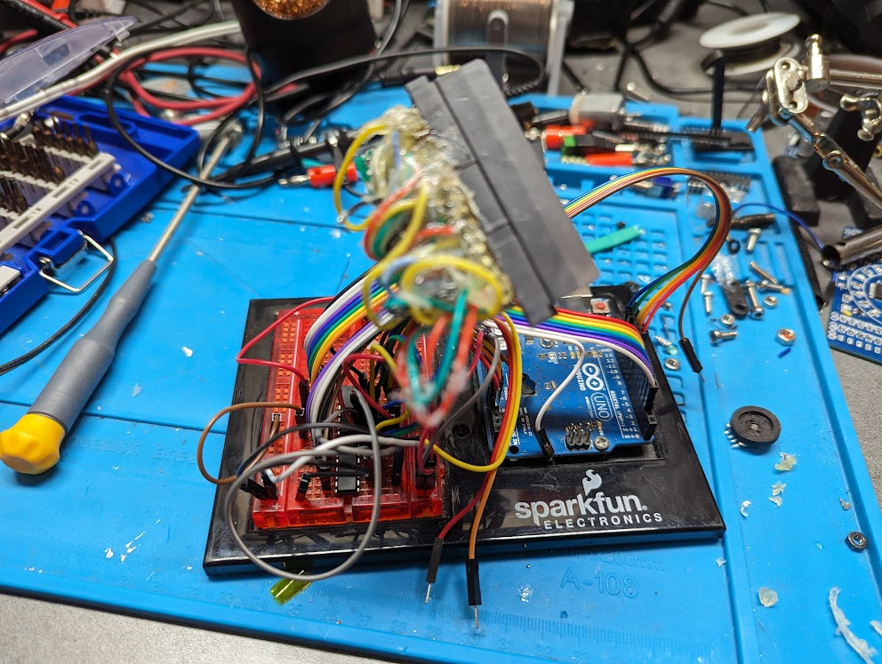

It's been done a thousand times, but it's always fun to make your own. 
The initial prototype was made on a breadboard with a [GBA cartridge connector](https://www.aliexpress.com/item/1005005016059093.html?spm=a2g0o.order_list.order_list_main.12.20411802sRNJEO) that I broke during some initial testing, and an Arduino Uno I've had laying around forever. 

First thing I did was solder the connector to a little piece of protoboard, and Dupont pins. Eventually my shoddy soldering job broke apart and I tried to fix it and fill it with hot glue to prevent the connections from breaking again, but it broke again post-gluing.

So, on to EasyEDA to design my first PCB! My design uses two SN74HC595 8-bit shift registers to send addresses to the cart, meanwhile all other signals are wired directly up to the GPIO pins of the Arduino.
