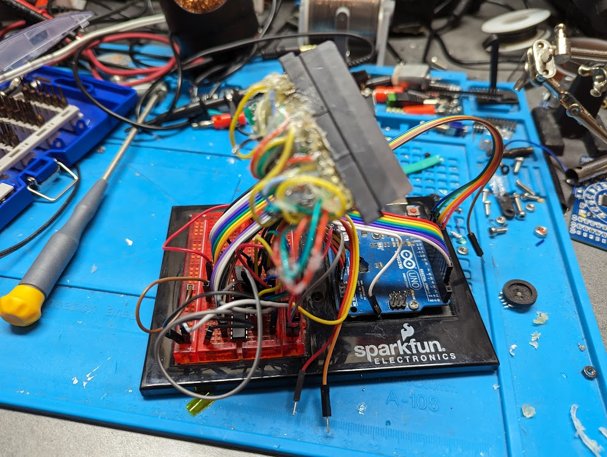

It's been done a thousand times, but it's always fun to make your own. 
The initial prototype was made on a breadboard with a [GBA cartridge connector](https://www.aliexpress.com/item/1005005016059093.html?spm=a2g0o.order_list.order_list_main.12.20411802sRNJEO) that I broke during some initial testing, and an Arduino Uno I've had laying around forever. 

First thing I did was solder the connector to a little piece of protoboard, and Dupont pins. Eventually my shoddy soldering job broke apart and I tried to fix it and fill it with hot glue to prevent the connections from breaking again, but it broke again post-gluing.

So, on to [EasyEDA](https://easyeda.com/) to design my first PCB! My design uses two [SN74HC595](https://www.ti.com/product/SN74HC595/part-details/SN74HC595DR) 8-bit shift registers to send addresses to the cart, meanwhile all other signals are wired directly up to the GPIO pins of the Arduino. This decision (along with the 5v logic level of the Arduino) means that I can't update the device to work with GBA carts through software. I believe it will work for GBC games, but I don't own any to test!
